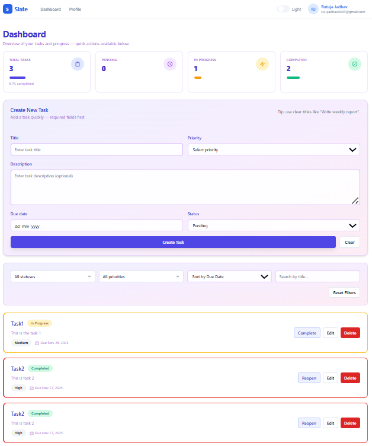
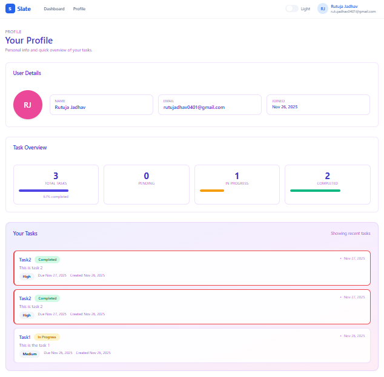
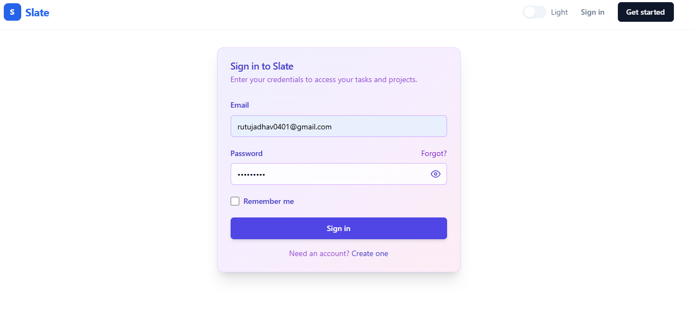

<div align="center">

# 🎯 Slate - Modern Task Management Platform

[](https://slate-task-management.vercel.app)

---

### 🌟 Overview

**Slate** is a sleek and powerful task management platform designed to streamline your productivity. Experience seamless task organization with intelligent filtering, priority-based workflows, and a beautifully crafted interface that adapts to your style. Built on modern web technologies including **SvelteKit** and **Supabase**, Slate delivers lightning-fast performance with real-time synchronization.

</div>

---

<div align="center">

## 🖼️ Application Preview

<table>
  <tr>
    <td align="center"><b>📊 Main Dashboard</b></td>
  </tr>
  <tr>
    <td></td>
  </tr>
  <tr>
    <td align="center"><b>🔑 Authentication</b></td>
  </tr>
  <tr>
    <td></td>
  </tr>
  <tr>
    <td align="center"><b>👥 User Profile</b></td>
  </tr>
  <tr>
    <td></td>
  </tr>
</table>

</div>

---

<div align="center">

## 🚀 Key Features

<table>
<tr>
<td width="50%" valign="top">

### 🛡️ Secure Authentication

- 🔒 Email-based user registration
- 🔐 Secure session handling
- 🔄 Password recovery system
- 🛣️ Route protection & redirects
- 💾 Persistent sessions
- ⚡ Real-time logout sync

### ✅ Task Operations

- ➕ Create detailed task entries
- ✏️ Modify existing tasks
- 🗑️ Safe deletion with prompts
- ☑️ Quick status toggling
- 🎯 Live Zod-based validation
- 🔄 Server & client validation

</td>
<td width="50%" valign="top">

### 🎛️ Smart Organization

- 📅 Sort by date, priority & status
- 🔍 Advanced filtering options
- 🔎 Fast title-based search
- 🏷️ Priority color indicators
- 📍 Clear status badges
- 🎨 Beautiful empty states

### 💫 User Experience

- 📱 Mobile-first responsive design
- 🌓 Theme switching (Dark/Light)
- ⏳ Loading state indicators
- 🔔 Toast notification system
- ✨ Fluid transitions
- ♿ WCAG accessibility standards

</td>
</tr>
</table>

</div>

---

<div align="center">

## 🧰 Technology Stack

<table>
  <tr>
    <td align="center" width="150">
      
      <br><b>SvelteKit</b>
      <br><sub>Core Framework</sub>
    </td>
    <td align="center" width="150">
      
      <br><b>shadcn-svelte</b>
      <br><sub>Component Library</sub>
    </td>
    <td align="center" width="150">
      
      <br><b>Supabase</b>
      <br><sub>Backend & Auth</sub>
    </td>
    <td align="center" width="150">
      
      <br><b>Zod</b>
      <br><sub>Schema Validation</sub>
    </td>
  </tr>
  <tr>
    <td align="center" width="150">
      
      <br><b>TailwindCSS</b>
      <br><sub>CSS Framework</sub>
    </td>
    <td align="center" width="150">
      
      <br><b>Lucide Svelte</b>
      <br><sub>Icon System</sub>
    </td>
    <td align="center" width="150">
      
      <br><b>PostgreSQL</b>
      <br><sub>Data Storage</sub>
    </td>
    <td align="center" width="150">
      
      <br><b>JavaScript</b>
      <br><sub>Core Language</sub>
    </td>
  </tr>
</table>

</div>

---

## ⚙️ Installation & Setup

### System Requirements

- Node.js version 18.x or newer
- npm or pnpm package manager
- Active Supabase account

### 1. Get the Code

```bash
git clone <your-repository-url>
cd Slate
```

### 2. Install Packages

```bash
npm install
```

### 3. Configure Supabase

#### Create Your Project

1. Navigate to [supabase.com](https://supabase.com) and log in
2. Select "New Project"
3. Configure your project:
   - **Project Name**: Slate Task Manager
   - **Database Password**: Generate a secure password (store safely)
   - **Region**: Select nearest location
4. Click "Create new project" and wait for setup

#### Authentication Setup

1. Navigate to **Authentication** → **Providers** in your dashboard
2. Verify **Email** provider is active
3. Visit **Authentication** → **Email Templates** for customization
4. **Development Mode**: Disable email confirmation temporarily:
   - Go to **Authentication** → **Providers** → **Email**
   - Toggle off "Enable email confirmations"

#### Database Schema Setup

1. Open **SQL Editor** in your Supabase project
2. Create a new query
3. Execute this SQL schema:

```sql
-- Tasks table structure
CREATE TABLE IF NOT EXISTS tasks (
  id UUID PRIMARY KEY DEFAULT gen_random_uuid(),
  user_id UUID NOT NULL REFERENCES auth.users(id) ON DELETE CASCADE,
  title TEXT NOT NULL,
  description TEXT DEFAULT '',
  priority TEXT NOT NULL CHECK (priority IN ('Low', 'Medium', 'High')),
  due_date TIMESTAMPTZ NOT NULL,
  status TEXT NOT NULL DEFAULT 'Pending' CHECK (status IN ('Pending', 'In Progress', 'Completed')),
  created_at TIMESTAMPTZ DEFAULT NOW(),
  updated_at TIMESTAMPTZ DEFAULT NOW()
);

-- Performance indexes
CREATE INDEX IF NOT EXISTS idx_tasks_user_id ON tasks(user_id);
CREATE INDEX IF NOT EXISTS idx_tasks_status ON tasks(status);
CREATE INDEX IF NOT EXISTS idx_tasks_due_date ON tasks(due_date);

-- Security policies
ALTER TABLE tasks ENABLE ROW LEVEL SECURITY;

-- Read policy
CREATE POLICY "Users can view own tasks"
  ON tasks FOR SELECT
  USING (auth.uid() = user_id);

-- Create policy
CREATE POLICY "Users can insert own tasks"
  ON tasks FOR INSERT
  WITH CHECK (auth.uid() = user_id);

-- Update policy
CREATE POLICY "Users can update own tasks"
  ON tasks FOR UPDATE
  USING (auth.uid() = user_id)
  WITH CHECK (auth.uid() = user_id);

-- Delete policy
CREATE POLICY "Users can delete own tasks"
  ON tasks FOR DELETE
  USING (auth.uid() = user_id);

-- Auto-update timestamp function
CREATE OR REPLACE FUNCTION update_updated_at_column()
RETURNS TRIGGER AS $$
BEGIN
  NEW.updated_at = NOW();
  RETURN NEW;
END;
$$ LANGUAGE plpgsql;

-- Timestamp trigger
CREATE TRIGGER update_tasks_updated_at
  BEFORE UPDATE ON tasks
  FOR EACH ROW
  EXECUTE FUNCTION update_updated_at_column();
```

4. Run the query
5. Confirm the `tasks` table exists in **Table Editor**

#### Retrieve API Credentials

1. Go to **Project Settings** → **API**
2. Copy these values:
   - **Project URL** (format: `https://xxxxx.supabase.co`)
   - **anon public** key (starts with `eyJ...`)

### 4. Environment Configuration

Create a `.env` file in your project root:

```env
SUPABASE_URL=your_supabase_project_url
SUPABASE_ANON_KEY=your_supabase_anon_key
```

**Locating Credentials:**
- Open your Supabase dashboard
- Go to Settings → API
- Copy the Project URL and anon/public API key

### 5. Launch Development Server

```bash
npm run dev
```

Access the application at `http://localhost:5173`

---

<div align="center">

## 🔮 Future Development

<table>
<tr>
<td width="50%" valign="top">

### 📋 Planned Features

- 🔄 **Live Sync**
  <br>Real-time task updates across devices
- ⏰ **Smart Reminders**
  <br>Notification system for upcoming tasks
- 👥 **Team Collaboration**
  <br>Shared workspaces and tasks
- 🏷️ **Custom Tags**
  <br>Flexible categorization system

</td>
<td width="50%" valign="top">

### 💡 Vision

- 📊 **Productivity Insights**
  <br>Analytics and completion tracking
- 📱 **Mobile App Experience**
  <br>PWA with offline capabilities
- 🔍 **Enhanced Search**
  <br>Advanced filtering and search
- 📎 **Media Support**
  <br>Attach documents and images

</td>
</tr>
</table>

</div>

---

<div align="center">

## 📜 License

This project is open-source and available for personal and educational use.

---

**Crafted with precision • Built on SvelteKit • Powered by Supabase**

</div>
